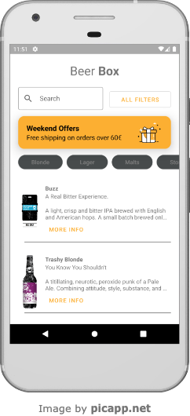
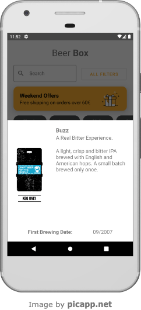
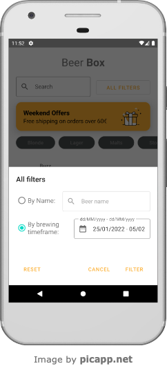
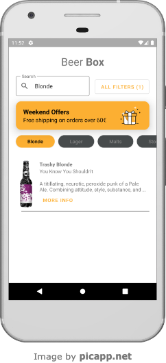

# BeerBox
A simple app that allows you to browse every beer in the world!\
This application uses [Punk API](https://punkapi.com/) to get beers.

## Installation 

Use your favourite IDE (mine is Android Studio) to open the project and get your hands on the code!

## Usage

You will be shown a list of beers. Tap on one of it to show details and brewing date:\
\

\
\
You can also filter beers by name or brewing date. Tap on _All filters_:\
\
\
\
And you will be shown your filtered list:\
\

## Contributing
Pull requests are welcome.\
For major changes, please open an issue first to discuss what you would like to change.\

Please make sure to update tests as appropriate.

## License

No, I don't have a license file.
